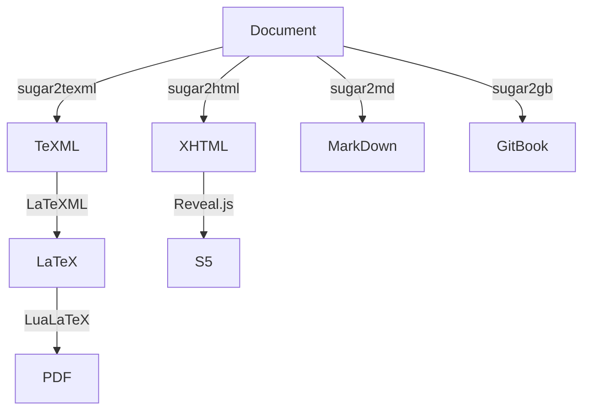

# Sugar2TeXML
XSLT converting .tex.xml file to [TeXML](http://getfo.org/texml) and some TeX files needed to compile.
In addition, [BibTeXML](http://bibtexml.sourceforge.net) may be needed. 

## component

